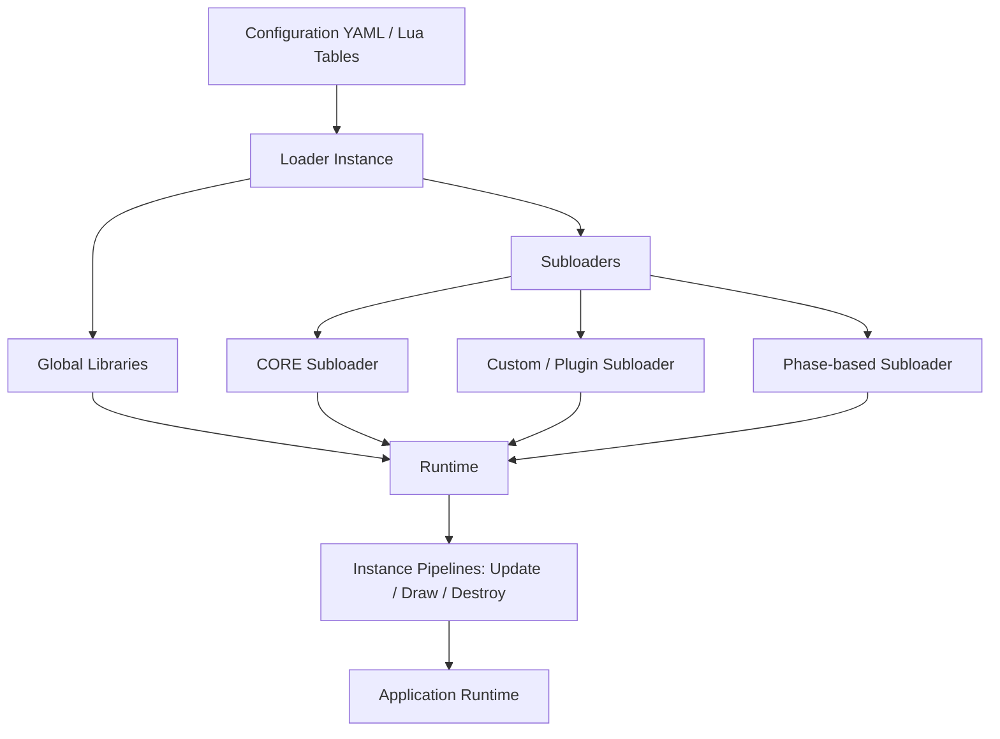

<a id="readme-top"></a>

[![Contributors][contributors-shield]][contributors-url]
[![Forks][forks-shield]][forks-url]
[![Stargazers][stars-shield]][stars-url]
[![Issues][issues-shield]][issues-url]
[![project\_license][license-shield]][license-url]
[![Email][email-shield]][email-url]

<br />
<div align="center">
	<a href="https://github.com/Gopmyc/Nexum">
		
	</a>

<h3 align="center">Nexum</h3>
<p align="center">
	A modular, secure, and highly flexible Lua framework for dynamic applications, games, and real-time systems.
	<br />
		<a href="https://gopmyc.github.io/Nexum/"><strong>Explore the docs »</strong></a>
	<br />
	<br />
		<a href="https://github.com/Gopmyc/Nexum/tree/main/tests">View Demo</a>
	· <a href="https://github.com/Gopmyc/Nexum/issues/new?labels=bug&template=bug-report---.md">Report Bug</a>
	· <a href="https://github.com/Gopmyc/Nexum/issues/new?labels=enhancement&template=feature-request---.md">Request Feature</a>
</p>
</div>

---

## About The Project

**Nexum** is a Lua framework designed for building **dynamic, secure, and modular applications or games**. It provides an advanced **loader and runtime system**, enabling fine-grained control over file execution, dependencies, and environments.

Nexum is **engine-agnostic**, compatible with LÖVR, Love2D, or any custom real-time loop. Its architecture allows:

* **Differentiated client/server loading** per file
* **Decentralized, controlled environments** for sandboxed execution
* **Subloaders** for phase-based loading
* **Injection of logic and environments per file** for controlled privileges
* **Local libraries per file**, isolated and client/server-aware
* **Debug mode** and full error handling to prevent crashes
* **Dynamic loading order and priority** based on external file dependencies
* **Plug-and-play modules** for easy extensibility

---

### Architecture Overview

#### 1. Subloaders

| Subloader         | Description                                    | Notes                                             |
| ----------------- | ---------------------------------------------- | ------------------------------------------------- |
| **CORE**          | Loads main files and initializes the runtime   | Automatically loads global libraries              |
| **Custom/Plugin** | Allows separate plug-and-play modules          | Each subloader can have local libraries           |
| **Phase-based**   | Splits the project into logical loading phases | Fine-grained control over load order and priority |

> Each subloader runs scripts in **sandboxed environments**, allowing CLIENT/SERVER privilege management.

#### 2. Libraries

| Library            | Role                                                   | Client/Server    |
| ------------------ | ------------------------------------------------------ | ---------------- |
| **runtime**        | Manages instances, Update/Draw/Destroy pipelines       | All              |
| **ressources**     | Script management, dependencies, conditional inclusion | All              |
| **orderer**        | Topological sorting and file priorities                | All              |
| **finder**         | Recursive Lua file discovery                           | All              |
| **env/builder**    | Builds secure environments per profile                 | All              |
| **env/loader**     | Loads scripts into sandboxed environments              | All              |
| **Custom Library** | Local libraries per file or subloader                  | CLIENT or SERVER |

> Libraries can be **initialized per file**, isolated by subloader, and configured for CLIENT, SERVER, or both.

---

#### 3. Workflow & Diagram



**Legend:**

* **Loader Instance**: orchestrates the loading process and initializes libraries.
* **Global Libraries**: shared utility modules (`runtime`, `ressources`, `orderer`, `finder`, `env/builder`, `env/loader`).
* **Subloaders**: split project into logical phases and plug-and-play modules. Each can have **local libraries** and **sandboxed environments**.
* **Runtime**: manages instances, pipelines, and automated cleanup.
* **Application Runtime**: the live execution of the project with Update/Draw/Destroy loops.

- **Phase-based loading** ensures files are loaded in proper order with dependencies resolved.
- **Sandboxed environments** allow fine-grained privilege control per file.
- **Runtime pipelines** manage instances automatically for update, draw, and destruction.

---

**Key Features:**

* 🔧 Differentiated CLIENT/SERVER loading per file
* 🔧 Secure sandboxed environments with privilege profiles
* 🔧 Subloaders for phase-based and modular loading
* 🔧 Local libraries per file, CLIENT/SERVER-aware
* 🔧 Dynamic load order and priority based on dependencies
* 🔧 Full error handling; optional debug mode
* 🔧 Runtime pipelines for instance management
* 🔧 Plug-and-play modules for extensibility

<p align="right"><a href="#readme-top">🔝</a></p>

---

### Built With

* 

<p align="right"><a href="#readme-top">🔝</a></p>

---

## Getting Started

Here’s how to set up the project!

### Prerequisites

* Lua installed: [https://www.lua.org/download.html](https://www.lua.org/download.html)

### Installation

1. Clone the repository:

   ```bash
   git clone https://github.com/Gopmyc/Nexum.git
   cd Nexum
   ```

2. Include `srcs/` in your Lua project:

   ```lua
   local Nexum = require("srcs")
   ```

---

## Usage

```lua
-- Initialize Nexum
local Nexum = require("srcs")

-- Instantiate an example object
local sInstanceName	= "SERVER ONE"
local myInstance	= Nexum:Instantiate("networking", sInstanceName)

-- Update loop
function love.update(dt)
    Nexum:Update(dt)
end

-- Draw loop
function love.draw()
    Nexum:Draw()
end

function love.quit()
	Nexum:Quit()
end
```

*For more examples, check the [documentation](https://gopmyc.github.io/Nexum/) or the [tests](https://github.com/Gopmyc/Nexum/tree/main/tests) folder.*

<p align="right"><a href="#readme-top">🔝</a></p>

---

## Roadmap

* [X] Increase modularity by allowing project configuration and default values ​​via YAML configuration.
* [X] The file loading process was split into groups named 'subloader'.
* [X] Add dynamic file loading priority generation based on external dependencies within subloaders
* [X] Enable secure file management for the parent environment
* [X] Allow the addition of 'plug and play' modules (without having to modify Nexum for integration)
* [X] Enabling the instantiation of loaded classes and autonomous management of their lifecycle
* [ ] Add an interface to facilitate adding and removing modules

Feel free to suggest features via [issues](https://github.com/Gopmyc/Nexum/issues).

<p align="right"><a href="#readme-top">🔝</a></p>

---

## Contributing

Contributions make open source better!
If you’ve got a fix or idea, fork and PR it.

Steps:

1. Fork this repo
2. Create a branch (`git checkout -b feature/MyFeature`)
3. Commit (`git commit -m 'Add MyFeature'`)
4. Push (`git push origin feature/MyFeature`)
5. Submit a Pull Request

(Please use [conventional commits](https://www.conventionalcommits.org/en/v1.0.0/))

### Top contributors:

<a href="https://github.com/Gopmyc/Nexum/graphs/contributors">
  
</a>

<p align="right"><a href="#readme-top">🔝</a></p>

---

## License

Distributed under the MIT License.
See [`LICENSE`](https://github.com/Gopmyc/Nexum/LICENSE) for more info.

<p align="right"><a href="#readme-top">🔝</a></p>

---

## Contact

**Gopmyc**
📧 [gopmyc.pro@gmail.com](mailto:gopmyc.pro@gmail.com)
🔗 [https://github.com/Gopmyc/Nexum](https://github.com/Gopmyc/Nexum)

<p align="right"><a href="#readme-top">🔝</a></p>

[contributors-shield]: https://img.shields.io/github/contributors/Gopmyc/Nexum.svg?style=for-the-badge
[contributors-url]: https://github.com/Gopmyc/Nexum/graphs/contributors
[forks-shield]: https://img.shields.io/github/forks/Gopmyc/Nexum.svg?style=for-the-badge
[forks-url]: https://github.com/Gopmyc/Nexum/network/members
[stars-shield]: https://img.shields.io/github/stars/Gopmyc/Nexum.svg?style=for-the-badge
[stars-url]: https://github.com/Gopmyc/Nexum/stargazers
[issues-shield]: https://img.shields.io/github/issues/Gopmyc/Nexum.svg?style=for-the-badge
[issues-url]: https://github.com/Gopmyc/Nexum/issues
[license-shield]: https://img.shields.io/github/license/Gopmyc/Nexum.svg?style=for-the-badge
[license-url]: https://github.com/Gopmyc/Nexum/blob/main/LICENSE
[email-shield]: https://img.shields.io/badge/Email-D14836?style=for-the-badge&logo=gmail&logoColor=white
[email-url]: mailto:gopmyc.pro@gmail.com