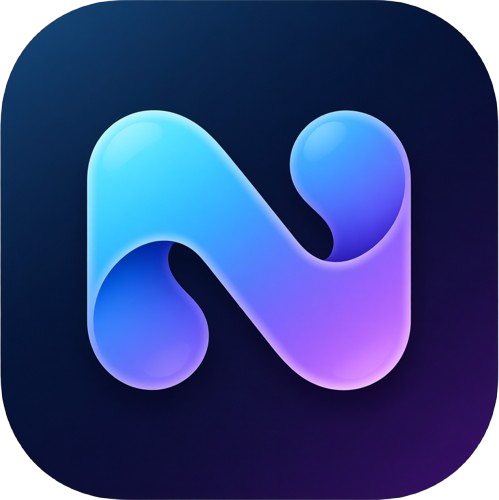
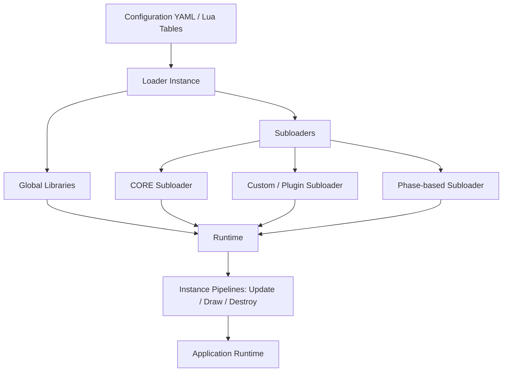

<a id="readme-top"></a>

[![Contributors][contributors-shield]][contributors-url]
[![Forks][forks-shield]][forks-url]
[![Stargazers][stars-shield]][stars-url]
[![Issues][issues-shield]][issues-url]
[![project\_license][license-shield]][license-url]
[![Email][email-shield]][email-url]

<br />
<div align="center">
	<a href="https://github.com/Gopmyc/Nexum">
		
	</a>

<h3 align="center">Nexum</h3>
<p align="center">
	A modular, secure, and highly flexible Lua framework for dynamic applications, games, and real-time systems.
	<br />
		<a href="https://gopmyc.github.io/Nexum/"><strong>Explore the docs »</strong></a>
	<br />
	<br />
		<a href="https://github.com/Gopmyc/Nexum/tree/main/tests">View Demo</a>
	· <a href="https://github.com/Gopmyc/Nexum/issues/new?labels=bug&template=bug-report---.md">Report Bug</a>
	· <a href="https://github.com/Gopmyc/Nexum/issues/new?labels=enhancement&template=feature-request---.md">Request Feature</a>
</p>
</div>

---

## About The Project

**Nexum** is a Lua framework designed for building **dynamic, secure, and modular applications or games**. It provides an advanced **loader and runtime system**, enabling fine-grained control over file execution, dependencies, and environments.

Nexum is **engine-agnostic**, compatible with LÖVR, Love2D, or any custom real-time loop. Its architecture allows:

* **Differentiated client/server loading** per file
* **Decentralized, controlled environments** for sandboxed execution
* **Subloaders** for phase-based loading
* **Injection of logic and environments per file** for controlled privileges
* **Local libraries per file**, isolated and client/server-aware
* **Debug mode** and full error handling to prevent crashes
* **Dynamic loading order and priority** based on external file dependencies
* **Plug-and-play modules** for easy extensibility

---

### Architecture Overview

#### 1. Subloaders

| Subloader         | Description                                    | Notes                                             |
| ----------------- | ---------------------------------------------- | ------------------------------------------------- |
| **CORE**          | Loads main files and initializes the runtime   | Automatically loads global libraries              |
| **Custom/Plugin** | Allows separate plug-and-play modules          | Each subloader can have local libraries           |
| **Phase-based**   | Splits the project into logical loading phases | Fine-grained control over load order and priority |

> Each subloader runs scripts in **sandboxed environments**, allowing CLIENT/SERVER privilege management.

#### 2. Libraries

| Library            | Role                                                   | Client/Server    |
| ------------------ | ------------------------------------------------------ | ---------------- |
| **runtime**        | Manages instances, Update/Draw/Destroy pipelines       | All              |
| **ressources**     | Script management, dependencies, conditional inclusion | All              |
| **orderer**        | Topological sorting and file priorities                | All              |
| **finder**         | Recursive Lua file discovery                           | All              |
| **env/builder**    | Builds secure environments per profile                 | All              |
| **env/loader**     | Loads scripts into sandboxed environments              | All              |
| **Custom Library** | Local libraries per file or subloader                  | CLIENT or SERVER |
| **relay**          | Automatic external module management                   | All              |


> Libraries can be **initialized per file**, isolated by subloader, and configured for CLIENT, SERVER, or both.

> The **Relay** module enables Nexum to manage external modules automatically:  
> download modules from manifests, cache them locally, delete files and folders safely, and track module status for plug-and-play reuse across sessions.

---

#### 3. Workflow & Diagram


```mermaid
flowchart TD
    A[Configuration YAML / Lua Tables] --> B[Loader Instance]
    B --> C[Global Libraries]
    B --> D[Subloaders]

    D --> D1[CORE Subloader]
    D --> D2[Custom / Plugin Subloader]
    D --> D3[Phase-based Subloader]

    C --> E[Runtime]
    D1 --> E
    D2 --> E
    D3 --> E

    E --> F[Instance Pipelines: Update / Draw / Destroy]
    F --> G[Application Runtime]
```

**Legend:**

* **Loader Instance**: orchestrates the loading process and initializes libraries.
* **Global Libraries**: shared utility modules (`runtime`, `ressources`, `orderer`, `finder`, `env/builder`, `env/loader`).
* **Subloaders**: split project into logical phases and plug-and-play modules. Each can have **local libraries** and **sandboxed environments**.
* **Runtime**: manages instances, pipelines, and automated cleanup.
* **Application Runtime**: the live execution of the project with Update/Draw/Destroy loops.

- **Phase-based loading** ensures files are loaded in proper order with dependencies resolved.
- **Sandboxed environments** allow fine-grained privilege control per file.
- **Runtime pipelines** manage instances automatically for update, draw, and destruction.

---

**Key Features:**

* 🔧 Differentiated CLIENT/SERVER loading per file
* 🔧 Secure sandboxed environments with privilege profiles
* 🔧 Subloaders for phase-based and modular loading
* 🔧 Local libraries per file, CLIENT/SERVER-aware
* 🔧 Dynamic load order and priority based on dependencies
* 🔧 Full error handling; optional debug mode
* 🔧 Runtime pipelines for instance management
* 🔧 Plug-and-play modules for extensibility
* 🔧 **Automatic module management via Relay**:
  * Download and install modules from remote manifests
  * Track installed/not installed state
  * Cache manifests for fast reload
  * Remove modules and clean folders automatically

<p align="right"><a href="#readme-top">🔝</a></p>

---

### Built With

* 

<p align="right"><a href="#readme-top">🔝</a></p>

---

## Getting Started

Here’s how to set up the project!

### Prerequisites

* Lua installed: [https://www.lua.org/download.html](https://www.lua.org/download.html)

### Installation

1. Clone the repository:

   ```bash
   git clone https://github.com/Gopmyc/Nexum.git
   cd Nexum
   ```

2. Include `srcs/` in your Lua project:

   ```lua
   local Nexum = require("srcs")
   ```

---

Parfait ! Voici une version complétée et plus détaillée pour la section **Usage**, avec deux exemples clairs d’utilisation de **Relay** :

## Usage

```lua
-- Initialize Nexum
local Nexum = require("srcs")

-- Instantiate a networking instance
local sInstanceName	= "SERVER ONE"
local myInstance	= Nexum:Instantiate("networking", sInstanceName)

-- Instantiate Relay for module management
local tRelay = Nexum:Instantiate("relay", "RELAY #1")

-- Example 1: Download a module
tRelay:RunCommand("/download MODULE_NAME")  -- Downloads module files, caches manifest, sets status

-- Example 2: Remove a module
tRelay:RunCommand("/delet MODULE_NAME")     -- Deletes module files and cleans empty folders

-- Example 3: Check module statuses
tRelay:RunCommand("/status")                -- Lists all modules with INSTALLED/NOT INSTALLED

-- Update loop
function love.update(dt)
    Nexum:Update(dt)
end

-- Draw loop
function love.draw()
    Nexum:Draw()
end

-- Quit handler
function love.quit()
    Nexum:Quit()
end
````

> You can also use Relay directly via command-line arguments when launching LOVR or LOVE2D projects, for example:

```bash
./lovr --console Nexum "SERVER" "/status"
./lovr --console Nexum "CLIENT" "/download networking"
```

> This allows you to dynamically manage external modules without modifying Nexum code. Modules are plug-and-play, cached, and automatically tracked between sessions.

*For more examples, check the [documentation](https://gopmyc.github.io/Nexum/) or the [tests](https://github.com/Gopmyc/Nexum/tree/main/tests) folder.*

<p align="right"><a href="#readme-top">🔝</a></p>

---

## Roadmap

* [X] Increase modularity by allowing project configuration and default values ​​via YAML configuration.
* [X] The file loading process was split into groups named 'subloader'.
* [X] Add dynamic file loading priority generation based on external dependencies within subloaders
* [X] Enable secure file management for the parent environment
* [X] Allow the addition of 'plug and play' modules (without having to modify Nexum for integration)
* [X] Enabling the instantiation of loaded classes and autonomous management of their lifecycle
* [X] Add an interface to facilitate adding and removing modules

Feel free to suggest features via [issues](https://github.com/Gopmyc/Nexum/issues).

<p align="right"><a href="#readme-top">🔝</a></p>

---

## Contributing

Contributions make open source better!
If you’ve got a fix or idea, fork and PR it.

Steps:

1. Fork this repo
2. Create a branch (`git checkout -b feature/MyFeature`)
3. Commit (`git commit -m 'Add MyFeature'`)
4. Push (`git push origin feature/MyFeature`)
5. Submit a Pull Request

(Please use [conventional commits](https://www.conventionalcommits.org/en/v1.0.0/))

### Top contributors:

<a href="https://github.com/Gopmyc/Nexum/graphs/contributors">
  
</a>

<p align="right"><a href="#readme-top">🔝</a></p>

---

## Project Tooling

### Documentation

The documentation for **Nexum** was generated using the [`doc_builder`](https://github.com/Gopmyc/docs_builder) tool.
The version of `doc_builder` used is specified in [`docs/VERSION`](docs/VERSION) of this repository.

The documentation uses the following YAML configuration file (`docs_config.yaml`):

```yaml id="h3km5t"
# PROJET
TITLE:        "Nexum"
DESCRIPTION:  "Lua framework designed for building dynamic, secure, and modular applications or games.\nIt provides an advanced loader and runtime system, enabling fine-grained control over file execution, dependencies, and environments.\n"
LICENSE_NAME: "MIT License"
LICENSE_URL:  "https://github.com/Gopmyc/Nexum/blob/main/LICENSE"

# FILE AND FOLDER CONFIGURATION
INPUT_FOLDER:   "docs/.srcs"
OUTPUT_FOLDER:  "docs"
EXTENSION:      ".html"
ROOT_PATH:      "docs/root"
INDENT_WIDTH:   2
MANIFEST_PATH:  "root/manifest.js"
MAIN_JS_PATH:   "main.js"

# CONSOL COLORS DEFINITIONS
CONSOLE:
  COLOR_RESET:    7
  COLOR_SUCCESS:  10
  COLOR_ERROR:    12
  COLOR_INFO:     11

# THEME ICONS DEFINITIONS
THEME_ICONS:
  DEFAULT:  "📚"
  DARK:     "🌙"
  LIGHT:    "☀️"

# COLORS FOR CLIENT AND SERVER DOCS
COLORS_SIDE:
  CLIENT: "#f1c40f"
  SERVER: "#3498db"

# THEME / COULEURS
THEME:
  BG_MAIN:            "#1F1F2E"
  BG_GRADIENT_START:  "#272739"
  BG_GRADIENT_END:    "#3B3B55"
  BG_PANEL:           "#2B2B42"
  BG_SIDEBAR:         "#323256"
  BG_HOVER:           "#3C3C6B"
  ACCENT:             "#8A6FF7"
  ACCENT_ALT:         "#F38BFF"
  TEXT_MAIN:          "#E6E6FA"
  TEXT_MUTED:         "#B0B0D0"
  TEXT_SUBTLE:        "#8888AA"
  BORDER_SOFT:        "#4A4A70"
  DOCK_BLOCK:         "#222236"
  TYPE_STRING:        "#E91E63"
  TYPE_NUMBER:        "#3F51B5"
  TYPE_BOOLEAN:       "#FF9800"
  TYPE_FUNCTION:      "#9C27B0"
  TYPE_TABLE:         "#4CAF50"
  TYPE_DEFAULT:       "#607D8B"
  RADIUS_LG:          "16px"
  RADIUS_MD:          "6px"
  TRANSITION_FAST:    "0.2s ease"
  TRANSITION_NORMAL:  "0.3s ease"
```

<p align="right"><a href="#readme-top">🔝</a></p>

---

### Commit Management

Commits in **Nexum** are managed automatically with [`AutoCommit`](https://github.com/Gopmyc/AutoCommit).
The commit rules are defined in a JSON configuration that maps file paths to commit actions, tags, emojis, and descriptions:

```json id="9t2wqe"
[
  {
    "path": "srcs/core/",
    "actions": {
      "add":     { "tag": "feat",      "emoji": "✨", "desc": "add core functionality" },
      "modify":  { "tag": "refactor",  "emoji": "♻️", "desc": "update core logic" },
      "delete":  { "tag": "chore",     "emoji": "🗑️", "desc": "remove core component" }
    }
  },
  {
    "path": "srcs/core/networking/",
    "actions": {
      "add":     { "tag": "feat",      "emoji": "🌐", "desc": "add networking logic" },
      "modify":  { "tag": "refactor",  "emoji": "🔁", "desc": "update networking code" },
      "delete":  { "tag": "chore",     "emoji": "🗑️", "desc": "remove networking code" }
    }
  },
  {
    "path": "srcs/modules/",
    "actions": {
      "add":     { "tag": "feat",      "emoji": "➕", "desc": "add module" },
      "modify":  { "tag": "refactor",  "emoji": "🧩", "desc": "update module" },
      "delete":  { "tag": "chore",     "emoji": "🗑️", "desc": "remove module" }
    }
  },
  {
    "path": "srcs/utils/",
    "actions": {
      "add":     { "tag": "feat",      "emoji": "🛠️", "desc": "add utility helper" },
      "modify":  { "tag": "refactor",  "emoji": "🔧", "desc": "update util logic" },
      "delete":  { "tag": "chore",     "emoji": "🗑️", "desc": "remove utility" }
    }
  },
  {
    "path": "config/",
    "actions": {
      "add":     { "tag": "config",    "emoji": "⚙️", "desc": "add config file" },
      "modify":  { "tag": "config",    "emoji": "♻️", "desc": "update configuration" },
      "delete":  { "tag": "chore",     "emoji": "🗑️", "desc": "remove config file" }
    }
  },
  {
    "path": "docs/.srcs/CORE/LOADER/",
    "actions": {
      "add":     { "tag": "docs",      "emoji": "📄", "desc": "add loader documentation" },
      "modify":  { "tag": "docs",      "emoji": "📝", "desc": "update loader documentation" },
      "delete":  { "tag": "docs",      "emoji": "🗑️", "desc": "remove loader documentation" }
    }
  },
  {
    "path": "docs/.srcs/ENV/",
    "actions": {
      "add":     { "tag": "docs",      "emoji": "📄", "desc": "add environment documentation" },
      "modify":  { "tag": "docs",      "emoji": "📝", "desc": "update environment documentation" },
      "delete":  { "tag": "docs",      "emoji": "🗑️", "desc": "remove environment documentation" }
    }
  },
  {
    "path": "docs/.srcs/GLOBAL_LIBRARIES/",
    "actions": {
      "add":     { "tag": "docs",      "emoji": "📄", "desc": "add global libraries documentation" },
      "modify":  { "tag": "docs",      "emoji": "📝", "desc": "update global libraries documentation" },
      "delete":  { "tag": "docs",      "emoji": "🗑️", "desc": "remove global libraries documentation" }
    }
  },
  {
    "path": "docs/pages/",
    "actions": {
      "add":     { "tag": "docs",      "emoji": "📄", "desc": "add generated HTML pages" },
      "modify":  { "tag": "docs",      "emoji": "📝", "desc": "update generated HTML pages" },
      "delete":  { "tag": "docs",      "emoji": "🗑️", "desc": "remove generated HTML pages" }
    }
  },
  {
    "path": "docs/index.html",
    "actions": {
      "add":     { "tag": "docs",      "emoji": "📄", "desc": "add documentation index" },
      "modify":  { "tag": "docs",      "emoji": "📝", "desc": "update documentation index" },
      "delete":  { "tag": "docs",      "emoji": "🗑️", "desc": "remove documentation index" }
    }
  },
  {
    "path": "docs/main.js",
    "actions": {
      "add":     { "tag": "docs",      "emoji": "📄", "desc": "add documentation JS" },
      "modify":  { "tag": "docs",      "emoji": "📝", "desc": "update documentation JS" },
      "delete":  { "tag": "docs",      "emoji": "🗑️", "desc": "remove documentation JS" }
    }
  },
  {
    "path": "docs/style.css",
    "actions": {
      "add":     { "tag": "docs",      "emoji": "📄", "desc": "add documentation CSS" },
      "modify":  { "tag": "docs",      "emoji": "📝", "desc": "update documentation CSS" },
      "delete":  { "tag": "docs",      "emoji": "🗑️", "desc": "remove documentation CSS" }
    }
  },
  {
    "path": "docs/root/manifest.js",
    "actions": {
      "add":     { "tag": "docs",      "emoji": "📄", "desc": "add manifest JS" },
      "modify":  { "tag": "docs",      "emoji": "📝", "desc": "update manifest JS" },
      "delete":  { "tag": "docs",      "emoji": "🗑️", "desc": "remove manifest JS" }
    }
  },
  {
    "path": "",
    "actions": {
      "add":     { "tag": "chore",     "emoji": "➕", "desc": "add miscellaneous file" },
      "modify":  { "tag": "chore",     "emoji": "♻️", "desc": "update miscellaneous file" },
      "delete":  { "tag": "chore",     "emoji": "🗑️", "desc": "delete miscellaneous file" }
    }
  }
]
```

<p align="right"><a href="#readme-top">🔝</a></p>

---

## License

Distributed under the MIT License.
See [`LICENSE`](https://github.com/Gopmyc/Nexum/LICENSE) for more info.

<p align="right"><a href="#readme-top">🔝</a></p>

---

## Contact

**Gopmyc**
📧 [gopmyc.pro@gmail.com](mailto:gopmyc.pro@gmail.com)
🔗 [https://github.com/Gopmyc/Nexum](https://github.com/Gopmyc/Nexum)

<p align="right"><a href="#readme-top">🔝</a></p>


[contributors-shield]: https://img.shields.io/github/contributors/Gopmyc/Nexum.svg?style=for-the-badge
[contributors-url]: https://github.com/Gopmyc/Nexum/graphs/contributors
[forks-shield]: https://img.shields.io/github/forks/Gopmyc/Nexum.svg?style=for-the-badge
[forks-url]: https://github.com/Gopmyc/Nexum/network/members
[stars-shield]: https://img.shields.io/github/stars/Gopmyc/Nexum.svg?style=for-the-badge
[stars-url]: https://github.com/Gopmyc/Nexum/stargazers
[issues-shield]: https://img.shields.io/github/issues/Gopmyc/Nexum.svg?style=for-the-badge
[issues-url]: https://github.com/Gopmyc/Nexum/issues
[license-shield]: https://img.shields.io/github/license/Gopmyc/Nexum.svg?style=for-the-badge
[license-url]: https://github.com/Gopmyc/Nexum/blob/main/LICENSE
[email-shield]: https://img.shields.io/badge/Email-D14836?style=for-the-badge&logo=gmail&logoColor=white
[email-url]: mailto:gopmyc.pro@gmail.com