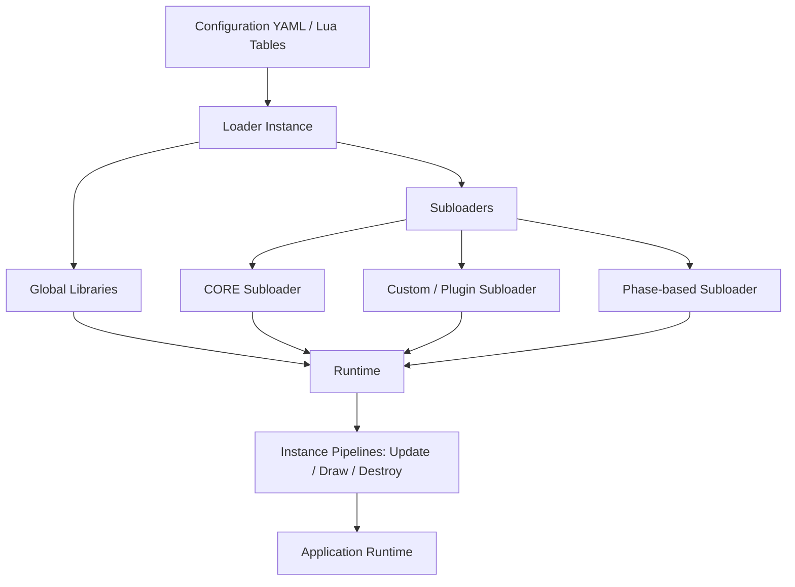

#### 3. Workflow & Diagram

```mermaid
flowchart TD
    A[Configuration YAML / Lua Tables] --> B[Loader Instance]
    B --> C[Global Libraries]
    B --> D[Subloaders]

    D --> D1[CORE Subloader]
    D --> D2[Custom / Plugin Subloader]
    D --> D3[Phase-based Subloader]

    C --> E[Runtime]
    D1 --> E
    D2 --> E
    D3 --> E

    E --> F[Instance Pipelines: Update / Draw / Destroy]
    F --> G[Application Runtime]
```
